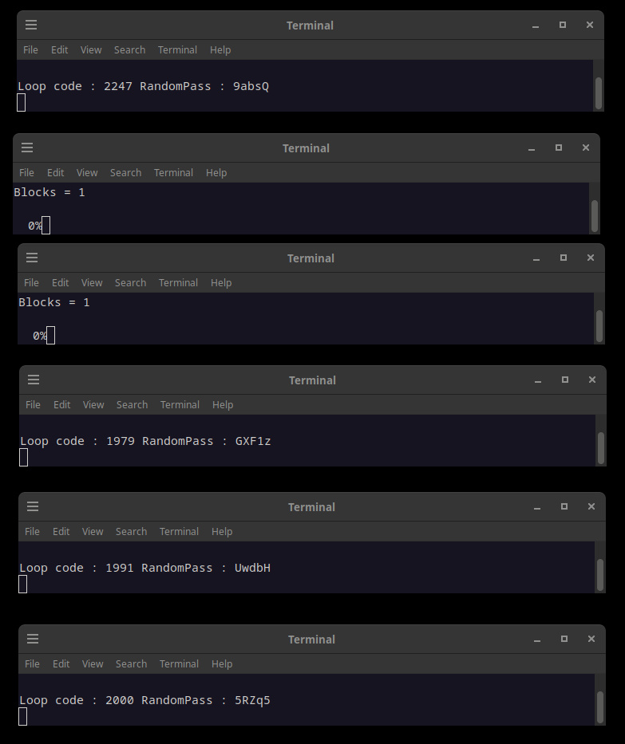
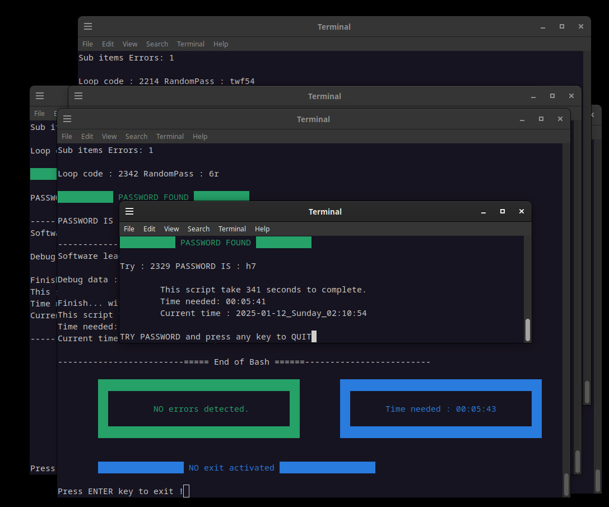
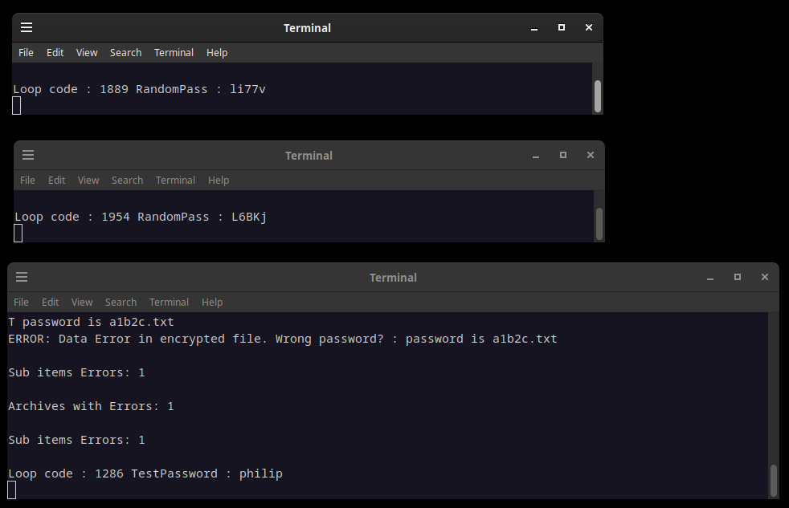

# CrackerJack

CrackerJack the easiest way to bruteforce a 7z protected file.
--------------------------------------------------------------------

!!! THIS IS FOR EDUCATIONNAL PURPOSE !!!

Recovery password for YOUR files.

When you have forgotten a password for your archives, do not try to crack/bruteforce files that do not belong to you.

Brute force attacks on 7z files involve systematically attempting every possible password combination to unlock encrypted archives created with the 7-Zip file compression software. Given that 7z files can be secured with strong encryption algorithms, such as AES-256, the complexity of the password significantly impacts the time required for a successful brute force attack.

FREE Linux Bash software by LostByteSoft

No CopyRIGHT or CopyLEFT, i am just in the CENTER. That not perfect but me neither.

For Debian linux (and related) OS.

Char in CrackerJack_X_char.sh represent the number of letters or numbers in the password length.

How to
--------------------------------------------------------------------

* Put all files in the same folder.

* Start each CrackerJack_X_char.sh (Yes 1 to 10)
	If you want with a dictionnary attack in the same time.
	Use dictionnary if you think the password is more than 10 char.

* Start multiples instances of each CrackerJack_X_char.sh (Auto select 7z file when you already selected an 7z file)
	Same for dictionnary.

* Wait for your password.

* When the password if found the software AUTOMATICLY stop all instances and show the password.

Exemples files
--------------------------------------------------------------------

* Start CrackerJack_1_char.sh with passwordis5.7z and wait.

* Try to bruteforce one included 7z in the first place.

* Expect password would be find under 5 minute.

* Try others 7z files too !
	passwordis5.7z
	passwordis545.7z
	passwordisa1b2c.7z
	passwordish7.7z
	
	There nothing in theses files except the password.

Files and use
--------------------------------------------------------------------

-CrackerJack_DictionnaryAttack.sh

	Try an attack by dictionnary (not included).
	You can find here : https://github.com/duyet/bruteforce-database

-CrackerJack_X_char.sh

	Each char represents the MAXIMUM number(s) of letters or numbers in the password.
	So start all if you don't know the numbers of char in the password.

-CrackerJack_1_char.sh

	Expect a pass found under 30 seconds.

-EraseTempFiles.sh

	To erase all temp files and password find.
	Do this if you want to find another password.
	Theses files are also erased if a password is found.

Screenshots
--------------------------------------------------------------------

* Start multiples instances of each CrackerJack_X_char.sh (Auto select 7z file)

* When the password if found the software AUTOMATICLY stop all instances and show the password.

*CrackerJack_DictionnaryAttack.sh (bottom) with 2 x CrackerJack_5_char.sh in parallel.

FREE Linux Bash software by LostByteSoft

--------------------------------------------------------------------

	JUST DO WHAT YOU WANT WITH THE PUBLIC LICENSE

	Version 3.1415926532 (January 2022)

	TERMS AND CONDITIONS FOR COPYING, DISTRIBUTION AND MODIFICATION
   
	Everyone is permitted to copy and distribute verbatim or modified copies of
	this license document.

	As is customary and in compliance with current global and interplanetary
	regulations, the author of these pages disclaims all liability for the
	consequences of the advice given here, in particular in the event of partial
	or total destruction of the material, Loss of rights to the manufacturer
	warranty, electrocution, drowning, divorce, civil war, the effects of radiation
	due to atomic fission, unexpected tax recalls or encounters with
	extraterrestrial beings elsewhere.

	LostByteSoft no copyright or copyleft we are in the center.

 	You can send your request and your Christmas wishes to this address:
 	
 		Père Noël
 		Pôle Nord, Canada
 		H0H 0H0

--------------------------------------------------------------------
# --- End of file ---
